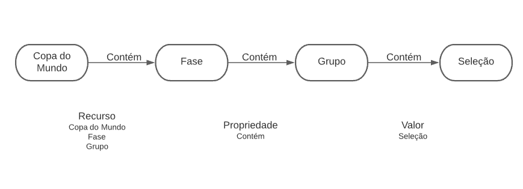
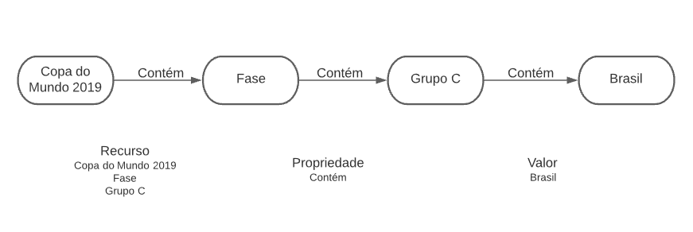

# Lab09 - Grafo de Conhecimento
# Aluno
* 234135: Fábio Santos Villar
## Grafo de conhecimento
O exemplo escolhido para a apresentação do grafo de conhecimento foi o acesso a dados relacionados especificamente às seleções da copa. As perguntas escolhidas exibidas a seguir servem justamente nessa linha de exemplo. Todavia, outras possibilidades existiam, tais como o acesso a dados relacionados a partidas, por exemplo, ou aos dados gerais às copas.

## Perguntas de Pesquisa 
* Quais as jogadoras da seleção brasileira em 2019?
* Qual a artilheira da seleção brasileira em 2015?
* Qual a seleção com mais gols em certo ano?
